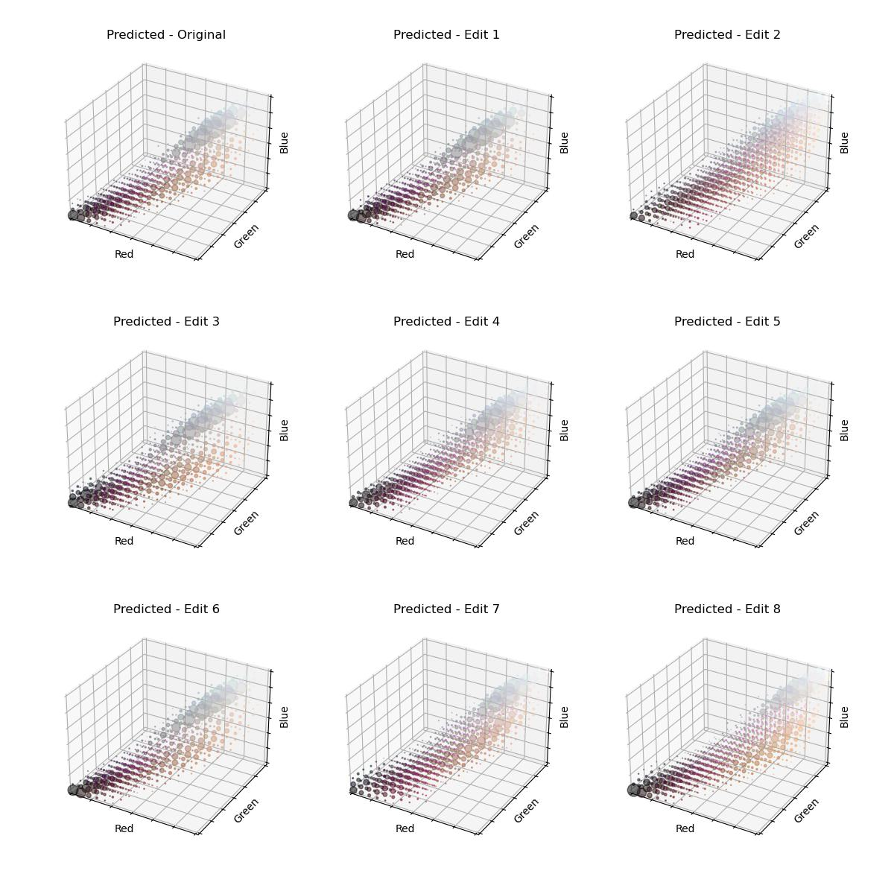

# Neural photo histogram enhancement

> Example of the network enhancing the colour of old digital photographs.

This project trains a neural network for automatically editing the style of digital photographs by learning a mapping from histograms of "bad" images to their aesthetic counterparts. Thus, both the inputs and outputs of the network are 3D RGB histograms: $`\text{bin}_{\text{red}} \times \text{bin}_{\text{green}} \times \text{bin}_{\text{blue}} \to \text{bin}'_{\text{red}} \times \text{bin}'_{\text{green}} \times \text{bin}'_{\text{blue}}`$

By only exposing histograms to the network, we allow it to learn style-tranfer while eliminating the risk of changing the underlying structure of the source image in the process which is a shortcoming of existing deep learning-based approaches [^1] & [^2]. At the same time, non-linear transformations of the RGB colour distribution allow for much greater flexibility than predefined global adjustment tools such as _Brightness_ or _Contrast_.

## Training overview

The neural network has been trained on community-acclaimed photos of Unsplash [^3]. We take each photo and [apply various edits](./src/operations/random_edit.py) to them, these include:

- Non-linearly transforming the brightness (including gamma correction)
- Adding color spill (colour temperatue & tint)
- Adjusting the saturation of different colours
- Changing the contrast
- Adding noise

An example image from the dataset together with 8 random edits applied to it is shown below:

> Image source: https://unsplash.com/photos/long-coated-brown-and-gray-puppy-covered-by-white-jacket-on-persons-lap-PZuIash2jZU

We can simply take the 3D RGB histograms of the photos' pixels. These are the following (with 1-to-1 correspondance with the above):

> For an interactive version of the histogram, open [inference.ipynb](./src/inference.ipynb).

Using these, the [training task](./src/training/train.py) of the [neural network](./src/models/histogram_net.py) is to predict the "Original" histogram given a single "Edit" histogram. The loss function is KL divergence.

After hyperparameter optimisation, the best performing model produces the following histogram predictions:

As we can see, the predictions closely line up with the original histogram. The model's ability to learn the mapping of "photo enhancing" is further supported by the results we get when appyling the predicted histograms to the edited images.

> Image source: https://unsplash.com/photos/long-coated-brown-and-gray-puppy-covered-by-white-jacket-on-persons-lap-PZuIash2jZU

We apply the predicted histograms to the source image using Pitie's method [^4].

## Background

Histogram-based colour transfer has been already explored [^5] to transfer colours between different images but not for enhancing the image's colours.

The input dataset's images "aesthetic goodness" serves as the baseline that the network is aspiring to learn a mapping to from less-aesthetic images. Thus, the high quality of the input images is paramount to the the network's success. The Unsplash [^3] dataset seems ideal for the metrics it provides conveying the included images' metrics, such as whether it was featured or its number of views. We could have chosen alternative datasets such as Laion Aesthetic [^6], however, this idea was quickly discarded due to the dataset's ethically questionable mode of collection.

[^1]: [High-Resolution Network for Photorealistic Style Transfer](https://github.com/limingcv/Photorealistic-Style-Transfer)
[^2]: [Deep Photo Style Transfer](https://github.com/luanfujun/deep-photo-styletransfer)
[^3]: [Unsplash Lite Dataset 1.2.2](https://github.com/unsplash/datasets)
[^4]:
    [N-Dimensional Probability Density Function Transfer and its
    Application to Colour Transfer](https://github.com/frcs/colour-transfer/tree/master)

[^5]: [Deep color transfer using histogram analogy](https://github.com/codeslake/Color_Transfer_Histogram_Analogy)
[^6]: [Laion Aesthetic](https://laion.ai/blog/laion-aesthetics)
