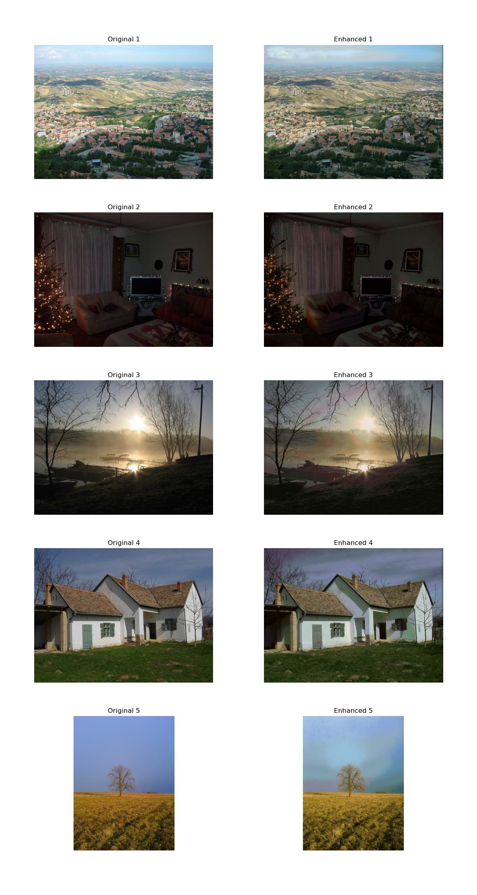
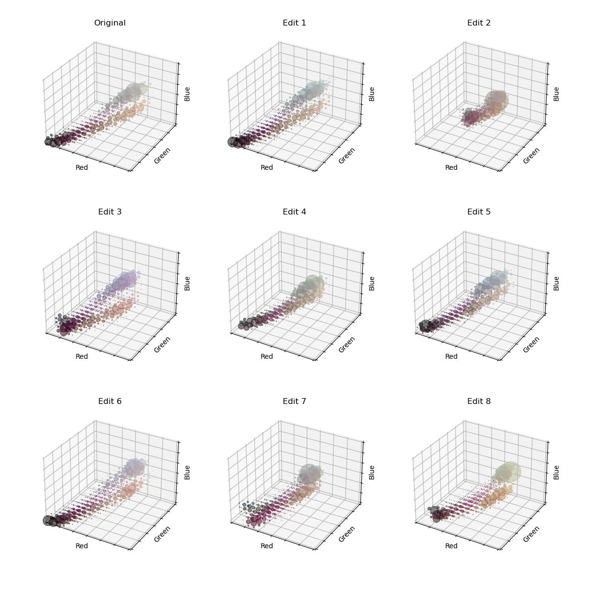

# Neural Photo Histogram Enhancement

> Example of the network enhancing the colour of old digital photographs.

This project develops a neural network to automate the style editing of digital photographs by learning to map from histograms of "bad" images to their aesthetically improved counterparts. The network processes and outputs 3D RGB histograms: $`\text{bin}_{\text{red}} \times \text{bin}_{\text{green}} \times \text{bin}_{\text{blue}} \to \text{bin}'_{\text{red}} \times \text{bin}'_{\text{green}} \times \text{bin}'_{\text{blue}}`$

By focusing solely on histograms, the model avoids altering the structural integrity of the image — a common issue with other deep learning-based style transfer methods [^1] & [^2]. This approach allows for flexible, non-linear adjustments to the RGB colour distribution, which surpasses the capabilities of basic global adjustment tools like _Brightness_ or _Contrast_.

## Training Overview

The training data consists of highly-regarded photos from Unsplash [^3]. We manually apply various edits to these photos, including:

- Non-linear transformations of brightness (gamma correction)
- Color spill adjustments (colour temperature & tint)
- Saturation modifications for different colors
- Contrast changes
- Noise addition

Below is an example image from the dataset, along with eight random edits:

> Image source: https://unsplash.com/photos/long-coated-brown-and-gray-puppy-covered-by-white-jacket-on-persons-lap-PZuIash2jZU

The corresponding 3D RGB histograms for these images are shown next:

> For an interactive exploration of the histogram, visit [inference.ipynb](./src/inference.ipynb).

The [training script](./src/training/train.py) for our [neural network model](./src/models/histogram_net.py) involves predicting the "Original" histogram from a "Modified" histogram, with KL divergence as the loss function.

After extensive hyperparameter optimisation, the top-performing model yields these histogram predictions:

The above predictions align closely with the original histograms, demonstrating the model's efficacy in learning the desired photo enhancement mapping.

> Image source: https://unsplash.com/photos/long-coated-brown-and-gray-puppy-covered-by-white-jacket-on-persons-lap-PZuIash2jZU

We use Pitie's method to apply the predicted histograms back to the source images [^4].

## Background

While histogram-based color transfer has been explored for color adaptation between images [^5], it has not been widely used for enhancing image aesthetics. Our dataset's "aesthetic quality" serves as a benchmark for the network to learn from visually unappealing images. The Unsplash dataset is chosen for its high-quality metrics, including features and views count, offering an ideal training environment. Other potential datasets like Laion Aesthetic were considered but dismissed due to concerns over the collection methods [^6].

[^1]: [High-Resolution Network for Photorealistic Style Transfer](https://github.com/limingcv/Photorealistic-Style-Transfer)
[^2]: [Deep Photo Style Transfer](https://github.com/luanfujun/deep-photo-styletransfer)
[^3]: [Unsplash Lite Dataset 1.2.2](https://github.com/unsplash/datasets)
[^4]:
    [N-Dimensional Probability Density Function Transfer and its
    Application to Colour Transfer](https://github.com/frcs/colour-transfer/tree/master)

[^5]: [Deep color transfer using histogram analogy](https://github.com/codeslake/Color_Transfer_Histogram_Analogy)
[^6]: [Laion Aesthetic](https://laion.ai/blog/laion-aesthetics)
